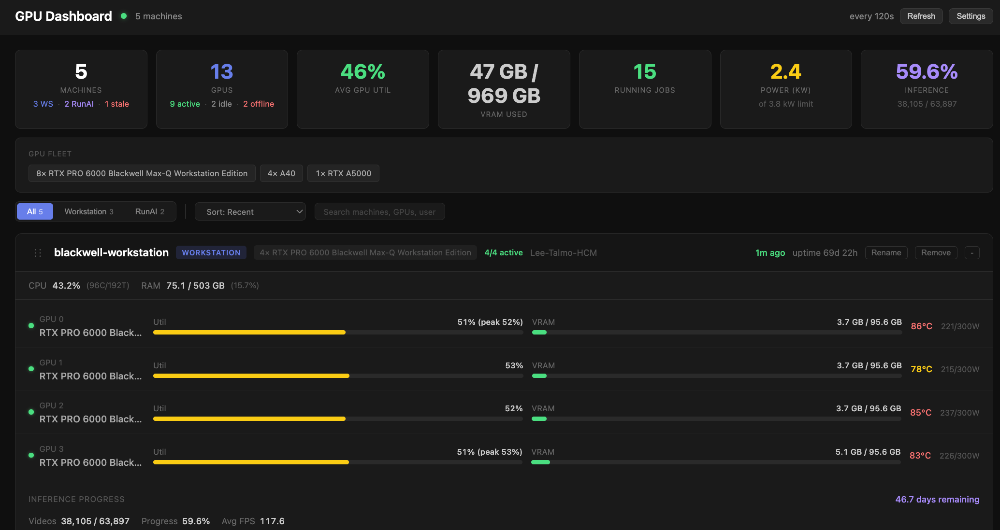
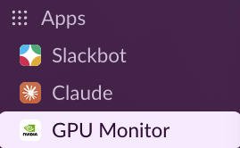
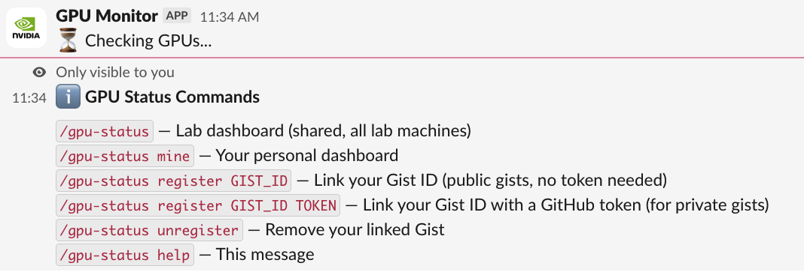
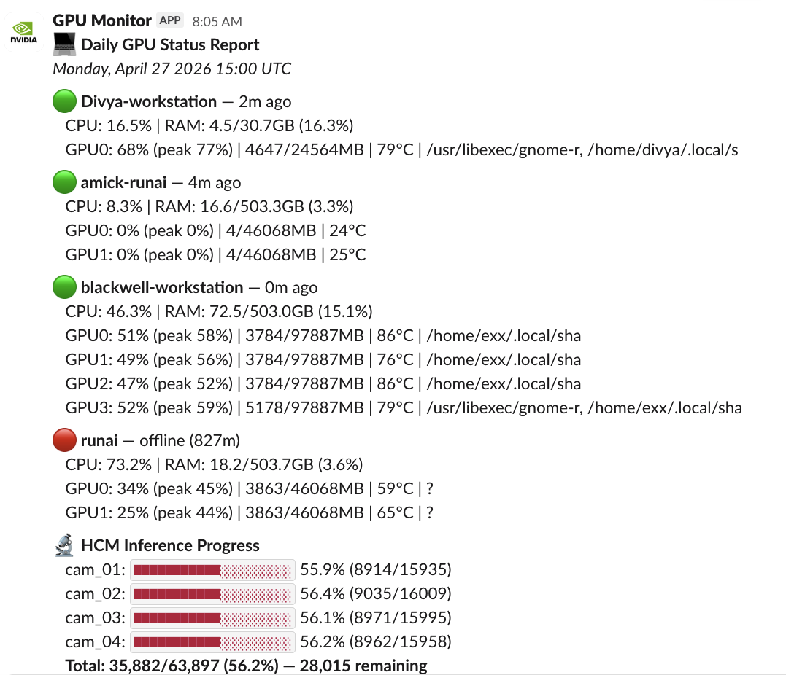

# GPU Dashboard

**https://vibes.tlab.sh/gpu-dashboard/**

Monitor GPUs across multiple workstations from a single web page. Lightweight agents push stats to a GitHub Gist; the dashboard reads and displays them. No server required.



## Features

- Real-time GPU utilization, VRAM, temperature, and power draw per GPU
- GPU state breakdown in summary bar (active / idle / offline)
- GPU fleet view showing model counts across all machines
- Filter by machine type (Workstation / RunAI), search, and sort
- Collapsible machine cards with per-GPU status dots
- CPU usage, RAM, and uptime per machine
- Per-process details (command, user, GPU memory, runtime)
- Peak GPU utilization (30-min rolling window)
- Inference progress tracking with per-camera breakdowns and ETA
- Drag-to-reorder and rename machines
- Auto-pause when tab is hidden, configurable refresh interval
- Filter/sort/collapse state persists in localStorage
- Works with Ubuntu workstations and RunAI pods
- Slack bot (`/gpu-status`) with personal dashboards and team sharing
- Dark theme, responsive layout

## How It Works

```
Workstation 1  ──push──►                              ◄──read── GitHub Pages
Workstation 2  ──push──►  GitHub Gist (JSON store)    ◄──       Dashboard
RunAI Pod      ──push──►
```

A lightweight Python agent runs on each machine, collects GPU/CPU/RAM stats every 30 seconds, and pushes them to a GitHub Gist. The dashboard reads the Gist and displays everything.

- **No server needed** — GitHub Gist is the data store, GitHub Pages hosts the dashboard
- **No inbound ports** — agents push outbound to GitHub API
- **Auto-pause** — stops polling when you switch browser tabs
- **Works anywhere** — Ubuntu workstations, RunAI, any machine with `nvidia-smi` and Python

## What It Shows

| Per Machine | Per GPU | Per Process |
|-------------|---------|-------------|
| CPU usage & core count | Utilization % | Command line |
| RAM usage | VRAM usage | GPU memory |
| Uptime | Temperature | User |
| Freshness (last report) | Power draw | Runtime |

## Quick Start

### First-time setup (dashboard owner)

1. Create a **secret** [GitHub Gist](https://gist.github.com) with any content and copy the Gist ID from the URL
2. Create a [Personal Access Token](https://github.com/settings/tokens) (classic, `gist` scope only)
3. Run the installer on your first machine (it will ask for the Gist ID and token)
4. Open the [dashboard](https://vibes.tlab.sh/gpu-dashboard/) and enter your Gist ID in Settings
5. Share the Gist ID with your team so they can add their machines

### Add a machine (Workstation)

```bash
pip install psutil requests

curl -sL https://raw.githubusercontent.com/talmolab/vibes/main/gpu-dashboard/agent/install.sh -o /tmp/gpu-install.sh && \
curl -sL https://raw.githubusercontent.com/talmolab/vibes/main/gpu-dashboard/agent/gpu_agent.py -o /tmp/gpu_agent.py && \
curl -sL https://raw.githubusercontent.com/talmolab/vibes/main/gpu-dashboard/agent/config.json -o /tmp/config.json && \
SCRIPT_DIR=/tmp bash /tmp/gpu-install.sh
```

The installer sets up a **systemd service** that auto-starts on boot.

### Add a machine (RunAI)

```bash
pip install psutil requests

curl -sL https://raw.githubusercontent.com/talmolab/vibes/main/gpu-dashboard/agent/install.sh -o /tmp/gpu-install.sh && \
curl -sL https://raw.githubusercontent.com/talmolab/vibes/main/gpu-dashboard/agent/gpu_agent.py -o /tmp/gpu_agent.py && \
curl -sL https://raw.githubusercontent.com/talmolab/vibes/main/gpu-dashboard/agent/config.json -o /tmp/config.json && \
SCRIPT_DIR=/tmp bash /tmp/gpu-install.sh
```

RunAI doesn't have systemd. Run the agent in tmux:

```bash
tmux new -d -s gpu-agent "python3 ~/.local/bin/gpu-agent"
```

> RunAI workspace restarts wipe everything. Re-run the installer after a restart.

## Slack Integration

Get GPU status directly in Slack with the `/gpu-status` slash command. Uses [Slack Bolt](https://slack.dev/bolt-python/) in Socket Mode — no public URL needed.



### Commands



| Command | Description |
|---------|-------------|
| `/gpu-status` | Show the shared lab dashboard (all machines) |
| `/gpu-status mine` | Show your personal dashboard |
| `/gpu-status register GIST_ID` | Link your Gist ID (public gists) |
| `/gpu-status register GIST_ID TOKEN` | Link with a GitHub token (private gists) |
| `/gpu-status unregister` | Remove your linked Gist |
| `/gpu-status help` | Show all commands |

### Example Output



### Setup

1. Create a Slack App with Socket Mode enabled and a `/gpu-status` slash command
2. Install the bot to your workspace
3. Run the bot on a machine with access to your Gist:
   ```bash
   pip install slack-bolt
   python3 slack_bot.py
   ```
4. Each team member can register their own Gist with `/gpu-status register GIST_ID`

The bot reads GPU data from the same Gist the dashboard uses — no additional infrastructure needed.

## Agent Usage

```bash
# Run continuously (default 30s interval)
python3 gpu_agent.py

# Single snapshot then exit (for cron)
python3 gpu_agent.py --once

# Custom interval
python3 gpu_agent.py --interval 60

# Print snapshot without pushing (test)
python3 gpu_agent.py --dry-run
```

## Inference Progress Tracking

The dashboard can track long-running inference jobs. When configured, each machine card shows per-camera progress bars, video counts, FPS, and estimated time remaining.

```
JSONL progress logs ──read──► GPU Agent ──push──► Gist ──read──► Dashboard
(written by inference)         (parses & summarizes)              (renders progress)
```

The inference script writes one JSONL line per completed video to `{camera}_progress.jsonl` files. The agent reads these logs, computes summary stats, and includes them in the Gist snapshot.

### JSONL Log Format

```json
{
  "status": "completed",
  "camera": "cam_01",
  "gpu": 0,
  "video": "cam_01.08.mp4",
  "fps": 119.6,
  "runtime_sec": 1503.2,
  "videos_done": 42,
  "videos_total": 15935,
  "timestamp": "2026-02-27T00:44:52Z"
}
```

| Field | Required | Description |
|-------|----------|-------------|
| `status` | yes | `"completed"` or `"failed"` |
| `videos_done` | yes | Cumulative count of finished videos for this camera |
| `videos_total` | yes | Total videos to process for this camera |
| `fps` | no | Frames per second (used for avg FPS) |
| `runtime_sec` | no | Wall-clock seconds (used for ETA) |
| `camera` | no | Camera name (also derived from filename) |
| `gpu` | no | GPU index (shown in dashboard) |
| `timestamp` | no | ISO 8601 timestamp |

### Setup

Add to `~/.config/gpu-dashboard/config.json`:

```json
{
    "inference_log_dir": "/path/to/inference_log",
    "inference_refresh_seconds": 3600
}
```

Then restart the agent: `systemctl --user restart gpu-agent`

## Configuration

| Config Key | Env Variable | Description |
|------------|-------------|-------------|
| `gist_id` | `GPU_DASH_GIST_ID` | GitHub Gist ID |
| `github_token` | `GPU_DASH_GITHUB_TOKEN` | GitHub PAT with `gist` scope |
| `machine_label` | `GPU_DASH_LABEL` | Display name on dashboard |
| `machine_type` | `GPU_DASH_TYPE` | `workstation` or `runai` |
| `interval_seconds` | — | Polling interval (default 120) |
| `inference_log_dir` | `GPU_DASH_INFERENCE_LOG_DIR` | Path to JSONL inference logs (optional) |
| `inference_refresh_seconds` | — | Cache duration for inference parsing (default 3600) |

## Security

- PAT only needs `gist` scope — cannot access repos or org settings
- Config file stored with `chmod 600` (owner-only read)
- Gist is **secret** (not listed on your profile, but readable by anyone with the URL)
- Dashboard stores Gist ID in browser `localStorage`

## Dependencies

- **Dashboard**: None (static HTML)
- **Agent**: Python 3 with `psutil`, `requests`, and `nvidia-smi`
